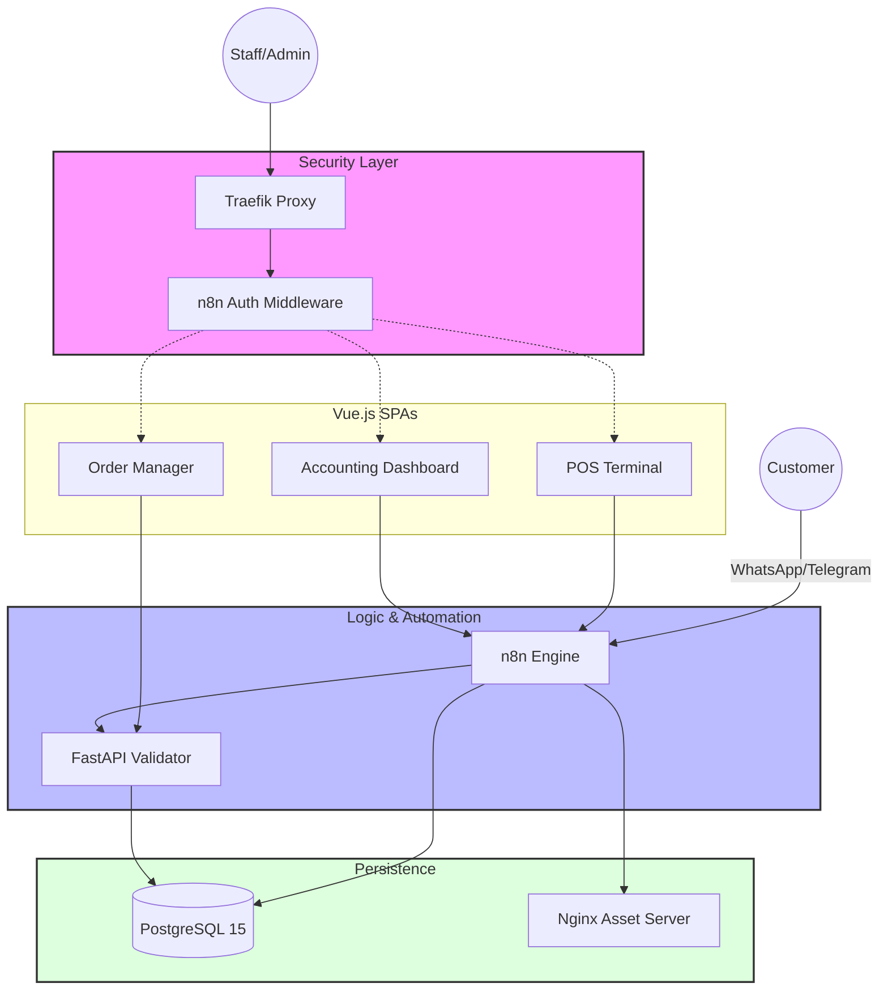

#  Precious Place Admin Suite

[](https://www.docker.com/)
[](https://vuejs.org/)
[](https://www.python.org/)
[](https://www.postgresql.org/)
[](https://n8n.io/)

A comprehensive business administration platform for a boutique bakery. This suite integrates a web-based Point of Sale (POS), a professional double-entry accounting system, and an AI-driven custom cake ordering assistant. It demonstrates the orchestration of specialized microservices into a unified workflow, automating the transition from operational sales to financial reporting while leveraging LLMs for natural language processing.

---

## 🏗️ Architecture



---

## 🛠️ Tech Stack

| Component | Technology | Purpose |
| :--- | :--- | :--- |
| **Ingress** | `Traefik` | SSL termination (Cloudflare DNS), routing, and forward-auth. |
| **Automation** | `n8n` | Backend orchestration, webhook handling, and AI prompting. |
| **Validation** | `FastAPI (Python)` | Rule-based validation logic for multi-tier cake orders. |
| **UI/UX** | `Vue 3 + Vite` | Interactive dashboards for POS and double-entry ledger. |
| **Persistence** | `PostgreSQL 15` | Relational storage for financial, operational, and chat state. |
| **Security** | `n8n Webhooks` | Centralized session validation for all admin routes. |
| **Styling** | `Tailwind CSS v4` | Modern utility-first CSS for responsive admin interfaces. |

---

## 📂 Project Structure

```text
📁 precious-place-admin/
├── 📄 docker-compose.yml           # Service orchestration and env mapping
├── 📁 n8n/
│   └── 📁 n8n-workflows/           # JSON exports of all automation logic
├── 📁 custom-cake-order-manager/
│   ├── 📁 python_app/
│   │   ├── 📄 app.py               # FastAPI entry point
│   │   └── 📁 utils/               # Core cake validation logic (cake_order_validator.py)
│   └── 📁 postgres/                # Schema for custom order state (04_00_custom_order_database.sql)
├── 📁 pos-frontend/                # Vue 3 terminal for sales operations
├── 📁 ledger-frontend/             # Vue 3 dashboard for bookkeeping
└── 📁 postgres/
    └── 📁 postgres-init/           # Schemas for accounting (03_...) and pos (02_...)
```

---

## 🚀 Quick Start

1.  **Clone with submodules:**
    ```bash
    git clone --recursive https://github.com/damienbarnesautomations/precious-place-admin.git
    cd precious-place-admin
    ```

2.  **Initialize Environment:**
    Create a `.env` in the root with values for `POSTGRES_USER`, `DOMAIN_OR_IP`, `N8N_DOMAIN`, and `DNS_TOKEN`.

3.  **Deploy Stack:**
    ```bash
    docker compose up -d
    ```
    *Note: Port 80 and 443 must be available for Traefik.*

---

## ⚙️ How it Works

1.  **AI Custom Order Pipeline**:
    *   **Extraction**: Messages from Telegram/WhatsApp are routed via `Admin__Telegram.json` (n8n) to an LLM.
    *   **Validation**: Structured data is sent to `python_app/utils/cake_order_validator.py`.
    *   **Rules**: The validator enforces multi-tier hierarchy and lead times (min 7 days) as defined in `04_00_custom_order_database.sql`.
    *   **Persistence**: Valid orders are committed to the `custom_orders` table.

2.  **POS & Financial Reconciliation**:
    *   **Sales**: The `pos-frontend` records transactions via `POS__Record_Sales.json`.
    *   **Auto-Journaling**: `POS__Accounting__Write_Sales_to_Journal.json` is triggered upon sale completion.
    *   **Integrity**: A balanced journal entry is created in the `accounting` DB, fulfilling the double-entry requirements in `03_create_accounting_db.sql`.

---

## 💡 Design Decisions

*   **Logic Decoupling**: used n8n as the orchestration layer instead of a monolith to allow visual logic editing for workflows while keeping compute-heavy validation in Python (`python_app/app.py`).
*   **Database-Level Integrity**: Implemented the `balanced_journal_trigger` in `03_create_accounting_db.sql` to prevent unbalanced journal entries at the schema level, ensuring financial accuracy.
*   **Metadata-Driven Validation**: Validation rules are stored as data, not code. `cake_order_validator.py` consumes the `order_config` and `field_rules` tables to dynamically adapt to new menu items or lead times.
*   **Centralized Security Proxy**: Employed Traefik's `forwardauth` middleware (`docker-compose.yml`) to decouple authentication from business services, using n8n as a unified identity provider.

---

## 🏆 Technical Highlights

*   **Full-Stack Orchestration**: Integrating Vue, Python, n8n, and PostgreSQL. **Ref:** `docker-compose.yml`.
*   **Financial Engineering**: Implementing a professional double-entry accounting system with strict constraints. **Ref:** `postgres/postgres-init/03_create_accounting_db.sql`.
*   **Structured AI Agents**: Moving beyond simple chat bots to rigorous data extraction and business-rule validation. **Ref:** `custom-cake-order-manager/python_app/utils/cake_order_validator.py`.
*   **Infrastructure Management**: Automated SSL (ACME) and complex microservice routing. **Ref:** Traefik labels in `docker-compose.yml`.

---

## ⚠️ Limitations

*   **Payments**: Manual verification is required; no live payment gateway (e.g., Stripe) integration is implemented.
*   **Inventory**: Sales are recorded, but the system does not yet perform real-time ingredient deduction from stock.
*   **Public Web**: There is no public-facing e-commerce storefront; the system is designed for internal admin and chat-based ordering.
